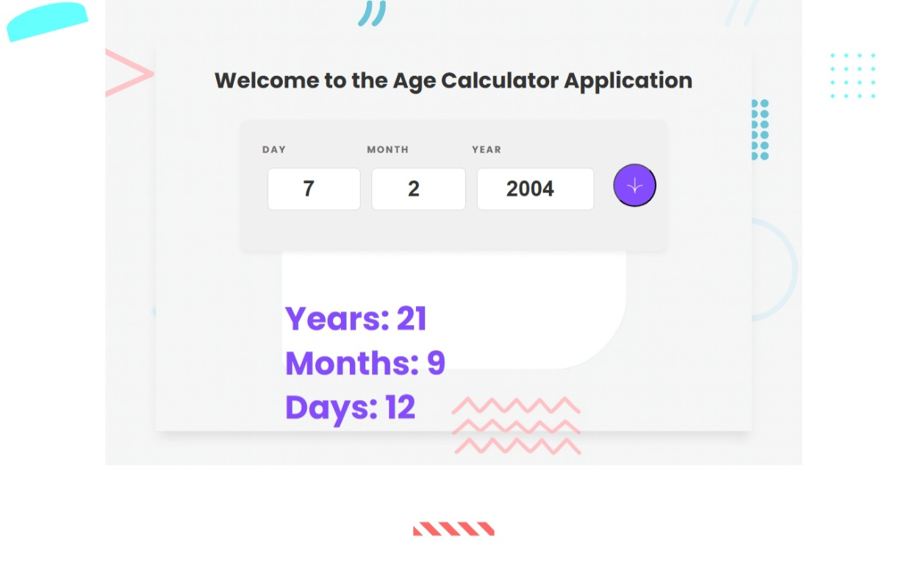

# Frontend Mentor - Age calculator app solution

This repository contains my solution to the Age calculator app challenge from Frontend Mentor. The project demonstrates form validation, date calculations and a responsive UI built with vanilla JavaScript, HTML and CSS.

## Table of contents

- [Overview](#overview)
- [The challenge](#the-challenge)
- [Screenshot](#screenshot)
- [Links](#links)
- [My process](#my-process)
  - [Built with](#built-with)
  - [What I learned](#what-i-learned)
  - [Continued development](#continued-development)
- [Useful resources](#useful-resources)
- [Author](#author)
- [Acknowledgments](#acknowledgments)

## Overview

### The challenge

Users should be able to:

- View an age in years, months, and days after submitting a valid date through the form.
- Receive validation errors when:
  - Any field is empty when the form is submitted.
  - The day number is not between 1–31.
  - The month number is not between 1–12.
  - The year is in the future.
  - The date is invalid (e.g., 31/04/1991 — April has 30 days).
- See a responsive layout that adapts to different screen sizes.
- See hover and focus states for interactive elements.
- Bonus: Age numbers animate to their final values when the form is submitted.

### Screenshot

Add a screenshot of your deployed project (for example the GitHub Pages URL) in the repository and update the path below:



## Links

- Solution URL: (https://github.com/monterrosadepaz-sudo-AGE-CALCULATOR)

- Live Site URL: (https://monterrosadepaz-sudo.github.io/AGE-CALCULATOR/)

## My process

### Built with

- Semantic HTML5 markup
- CSS custom properties
- Flexbox
- CSS Grid
- Mobile-first workflow
- Vanilla JavaScript (DOM manipulation, validation, date calculations)

### What I learned

During this project I focused on correct date handling and user-friendly validation. Key takeaways:

- How to validate dates using the JavaScript `Date` object and handle edge cases (months with different lengths, leap years).
- The importance of using relative paths for assets when deploying to GitHub Pages to avoid 404 errors.
- How to load local fonts with `@font-face` and ensure correct font weights.
- Using DevTools to debug resource loading and CSS layout issues.

Example snippet of the age calculation logic used in the app:

```js
function calculateAge(day, month, year) {
  const today = new Date();
  const birthDate = new Date(year, month - 1, day);

  let years = today.getFullYear() - birthDate.getFullYear();
  let months = today.getMonth() - birthDate.getMonth();
  let days = today.getDate() - birthDate.getDate();

  if (days < 0) {
    months--;
    days += new Date(today.getFullYear(), today.getMonth(), 0).getDate();
  }

  if (months < 0) {
    years--;
    months += 12;
  }

  document.getElementById('years').textContent = years;
  document.getElementById('months').textContent = months;
  document.getElementById('days').textContent = days;
}
```

### Continued development

Areas to improve in future iterations:

- Add subtle animations to the result numbers when they change (bonus requirement).
- Improve accessibility (ARIA attributes, better keyboard navigation and focus management).
- Add unit tests for validation and calculation functions.
- Enhance visual polish while maintaining performance and responsiveness.

## Useful resources

- MDN Web Docs — `Date` object and date manipulation.
- MDN Web Docs — `@font-face` and font loading best practices.
- GitHub Pages documentation — tips for deployment and path handling.

## Author

- GitHub - monterrosadepaz-sudo

## Acknowledgments

Thanks to the Frontend Mentor community for the challenge and to DevTools for helping debug layout and asset loading issues.

